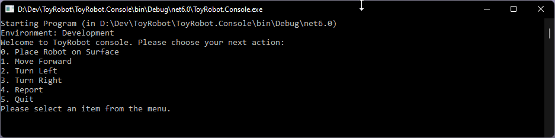
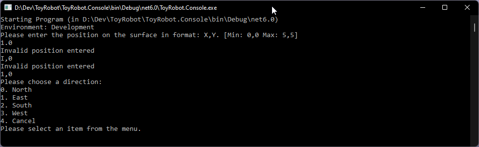
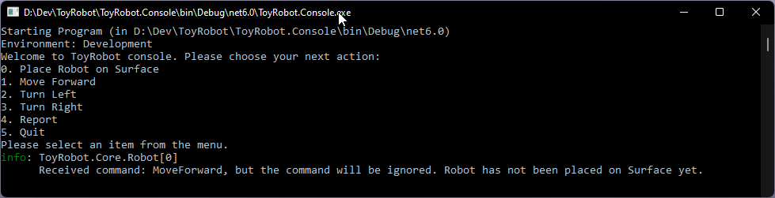
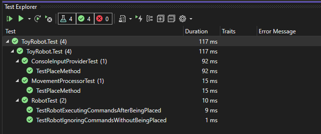

# ToyRobot
This repository was created for the purpose of implementing a Code challenge named ToyRobot

## Challenge
Create a console application that can read in commands of the following form:

PLACE X,Y,F 
MOVE 
LEFT 
RIGHT 
REPORT 

<b>PLACE</b> - will put the toy robot on the table in position X,Y and facing NORTH, SOUTH, EAST or WEST. The origin (0,0)
can be considered to be the SOUTH WEST most corner. It is required that the first command to the robot is a PLACE
command, after that, any sequence of commands may be issued, in any order, including another PLACE command. The
application should discard all commands in the sequence until a valid PLACE command has been executed. 

<b>MOVE</b> - will move the toy robot one unit forward in the direction it is currently facing. 

<b>LEFT and RIGHT </b> - will rotate the robot 90 degrees in the specified direction without changing the position of the
robot.  

<b>REPORT</b> - will announce the X,Y and F of the robot. This can be in any form, but standard output is sufficient.

A robot that is not on the table can choose to ignore the MOVE, LEFT, RIGHT and REPORT commands. <i>[I chose to ignore the input]</i> 

Input can be from a file, or from standard input, as the developer chooses. <i>[I chose standard console input]</i>

Provide test data to exercise the application. [My input-choice doesn't need test data]

## Constraints:

1. The toy robot must not fall off the table during movement. This also includes the initial placement of the toy robot. Any
move that would cause the robot to fall must be ignored.

2. It is not required to provide any graphical output showing the movement of the toy robot.
3. The application should handle error states appropriately and be robust to user input.

## How to build & use this project:

This project requires Visual Studio 2022 to build, which has proven to work fast & reliable, even with decade-old solutions.

For implementation I chose to use .Net6 (6.0.6 to be precise), which will be the only [supported .Net and .Net Core Version by Microsoft](https://docs.microsoft.com/en-us/lifecycle/products/microsoft-net-and-net-core), in year 2023+. But to be clear, my day-to-day work is a mix of various DotNet versions (from .Net Framework 4.x - .Net 6), which I'm perfectly comfortable with (to switch between).

To Run the project, set the project called <b>ToyRobot.Console</b> as the startup-project and run it. 

## User input:
To acquire user input, I decided to use a nuget package which provides a fast, simple, and robust console menu:

The menu is robust (input-wise) and does not allow invalid user input with proper feedback: 

By default, the loglevel is set to Warn. Lowering this can be done by changing the settings in <mark>appsettings.Development.json</mark>. Note that loglevel info will output verbosely when & why commands are ignored: 

## Tests:
I've implemented some unit tests for illustration:  

